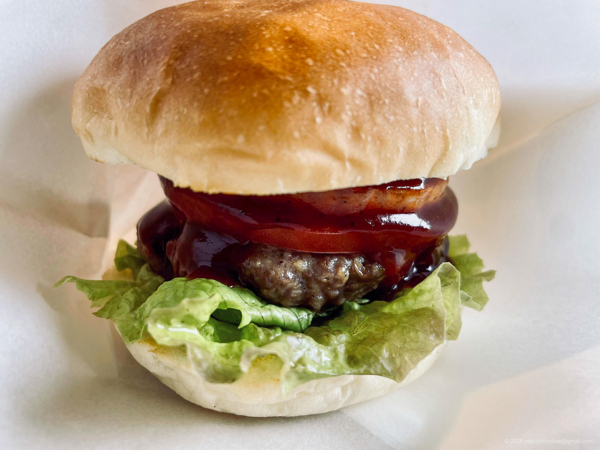
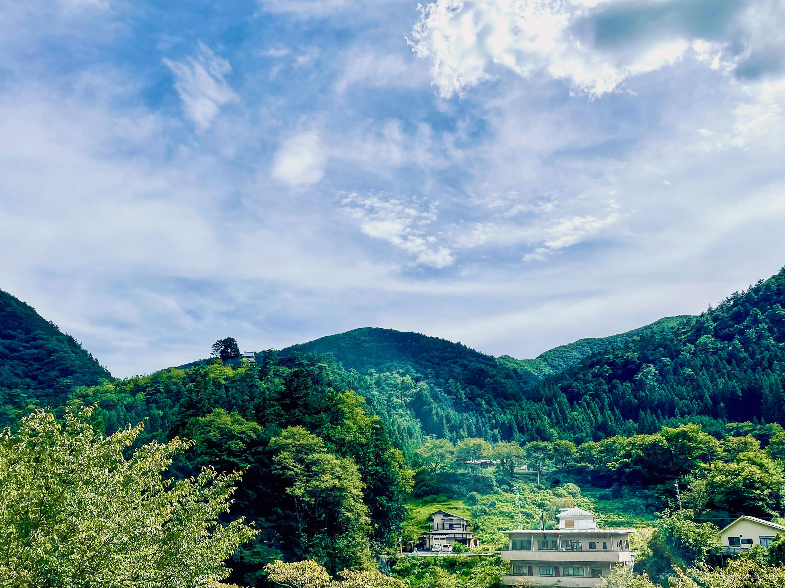
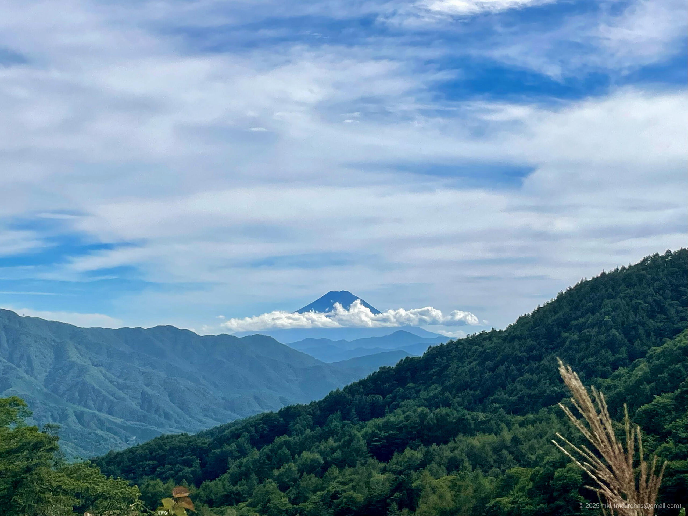
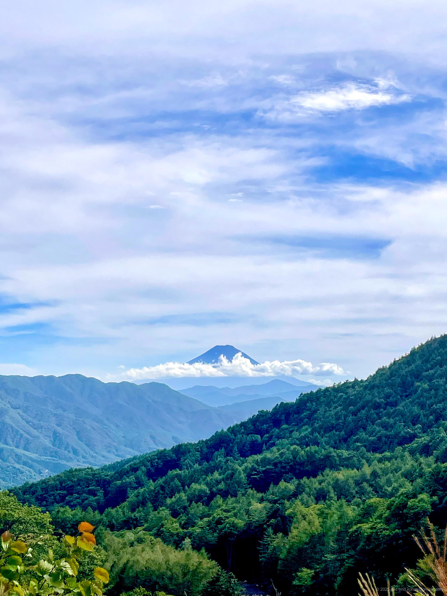
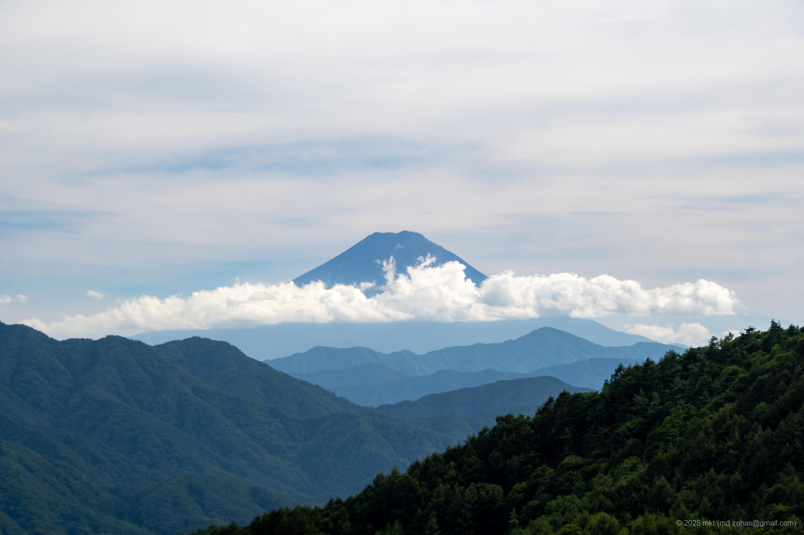
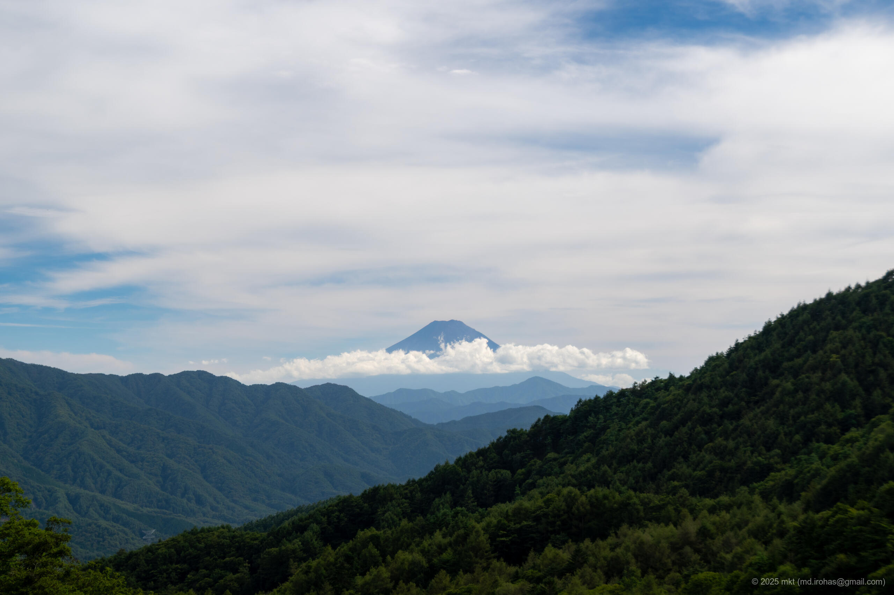

+++
title = 'Trip Photo: Daibosatsu Line (August, 2023)'
date = '2025-11-13'
categories = ['Blog (Trip Photo)']
tags = ['Travel', 'Photo', 'Yamanashi', 'Scenic Road']

isCJKLanguage = false
description = '🗻 A blog post about photos I took while driving the Daibosatsu Line in August 2023.'
summary = '📍 Roadside Station Tabayama, Daibosatsu Line, Mt. Fuji Viewpoint (Daibosatsu Line)'

draft = false

# Params
googlePhotoUrl = 'https://photos.app.goo.gl/oGufApWquDTRZpNU8'
googleDriveUrl = 'https://drive.google.com/drive/folders/1OmByhGTKUCj5m5eNuNIqi7vPTfsS1hjY'
+++

 
 


This post is based on photos I took in 2023.


## Story

In August 2023, I drove along the Daibosatsu Line.

The Daibosatsu Line is the common name for Route 411, which runs from Tabayama Village in Yamanashi Prefecture to Koshu City.
It can be a fairly steep mountain road, but it is well maintained and features a loop bridge, which makes it a popular spot for touring.

On this trip I drove from the Tabayama side toward Koshu.

First, I headed to the Roadside Station Tabayama.



At the roadside station, there was a cafe serving game meat dishes, and I tried a venison burger there.



From behind the cafe, I could see what is called "Tabayama Castle" in the distance.
It's not an actual historical castle, but rather a tourist facility;
apparently it is the starting point for a roller slide that is said to be the longest in Japan.



Tabayama Village is surrounded by deep mountains and has a quiet, calm atmosphere.

From the roadside station, I continued west.
After crossing the Yanagisawa Pass and descending, there is a loop bridge with a small parking area and a viewpoint.
Google Maps labels it as a "Mt. Fuji Viewpoint," though I couldn't find an official name.

From that viewpoint, I could see Mt. Fuji beyond the mountain ranges on the Koshu side.
It was a very natural, unspoiled view -- Mt. Fuji in the distance with almost no man-made objects in sight.








  




From there, I continued on to Koshu and then drove home on local roads.

## Gallery





### iPhone 12 mini





### α6500







## Map

### Roadside Station Tabayama



### Mt. Fuji Viewpoint (Daibosatsu Line)



### Sites



## Change History

- 2024/11/14: First version.
