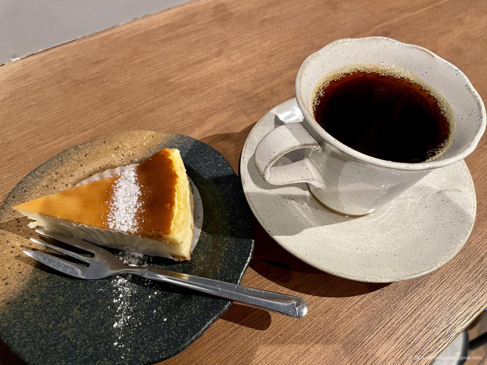
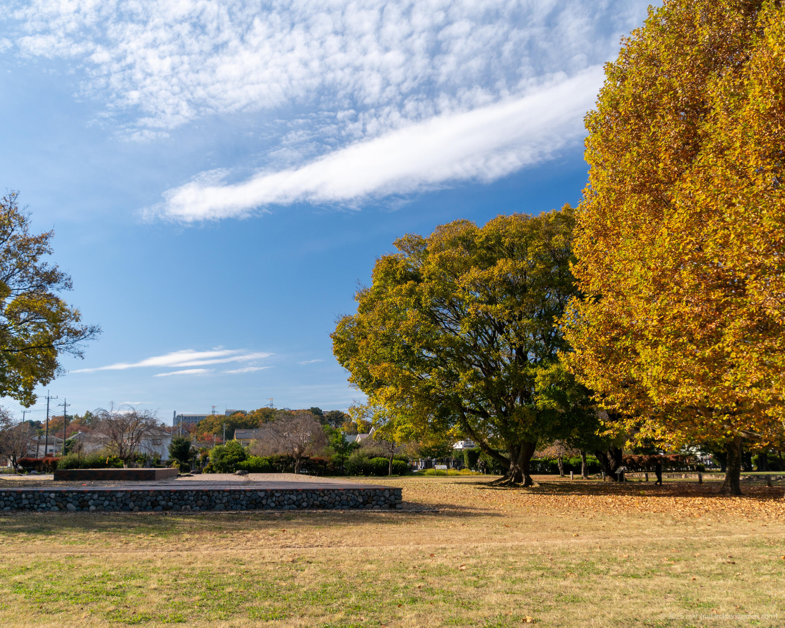
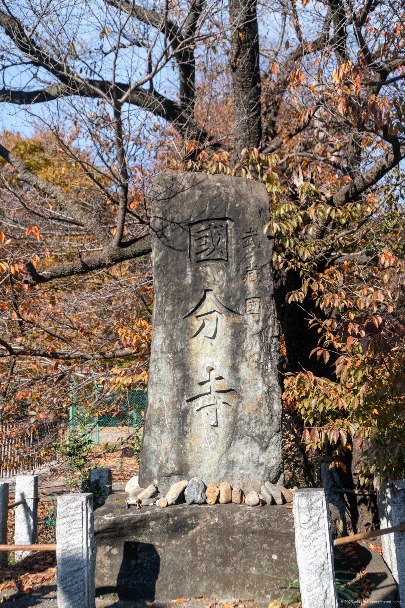
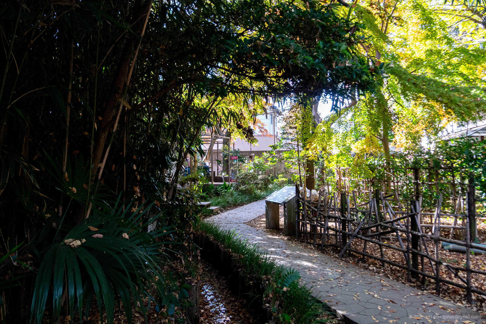
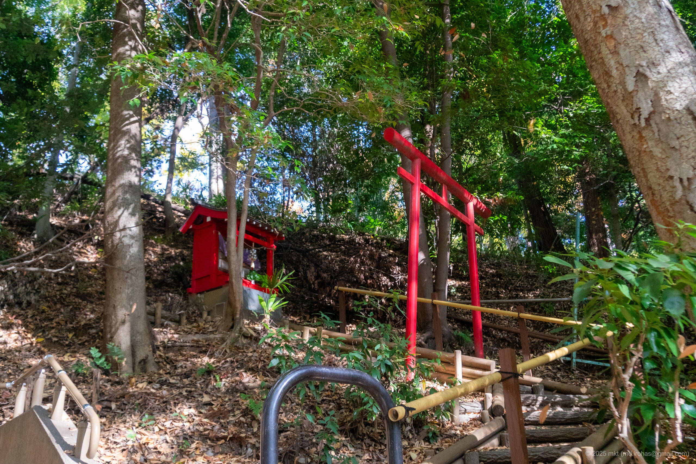
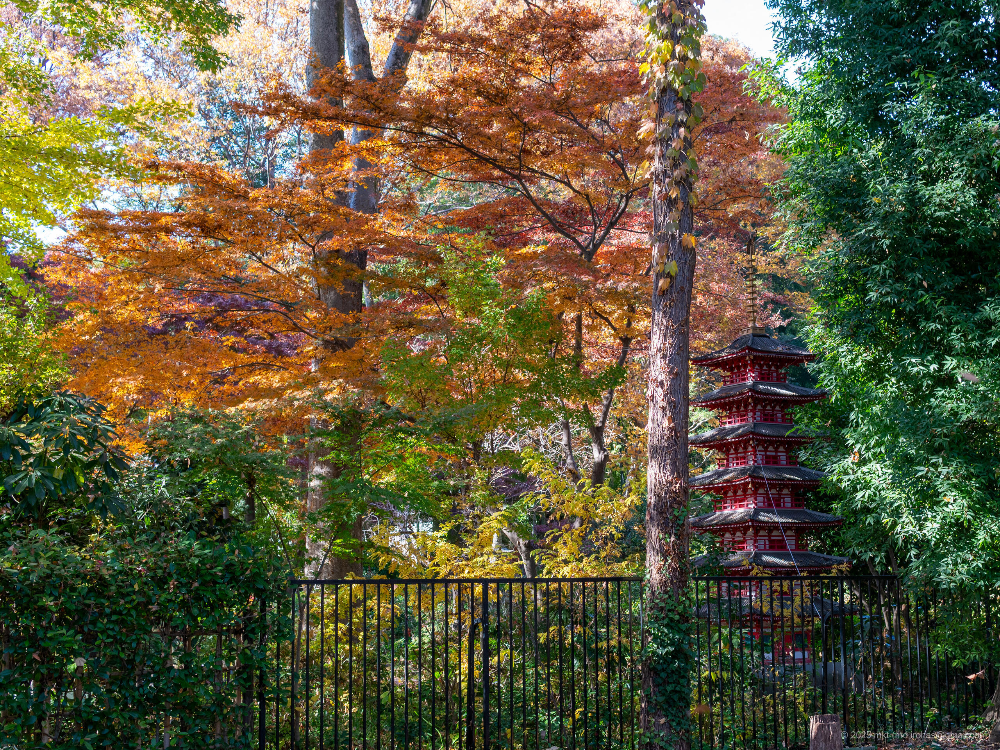
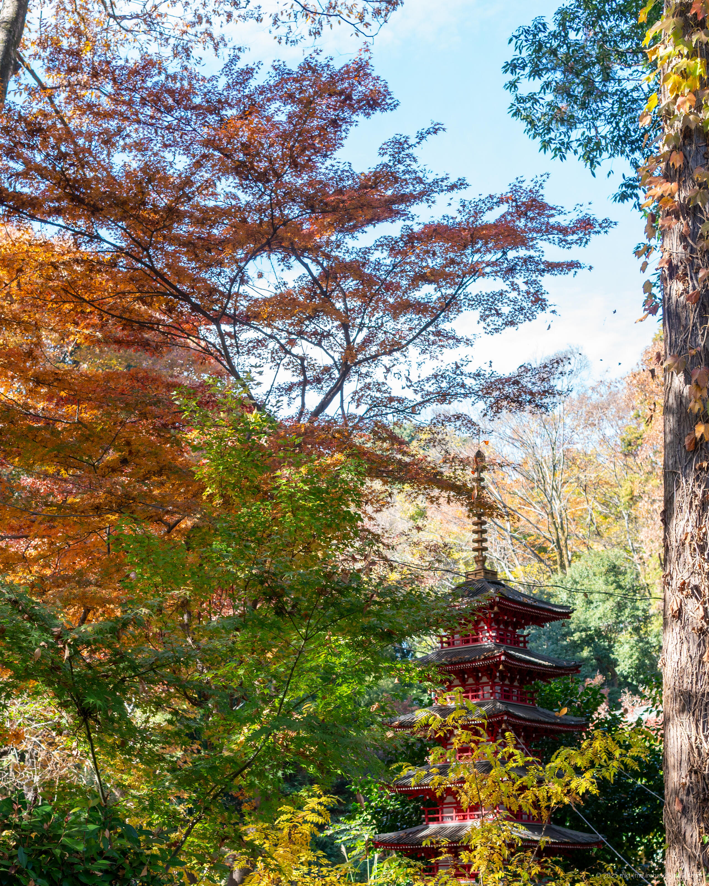
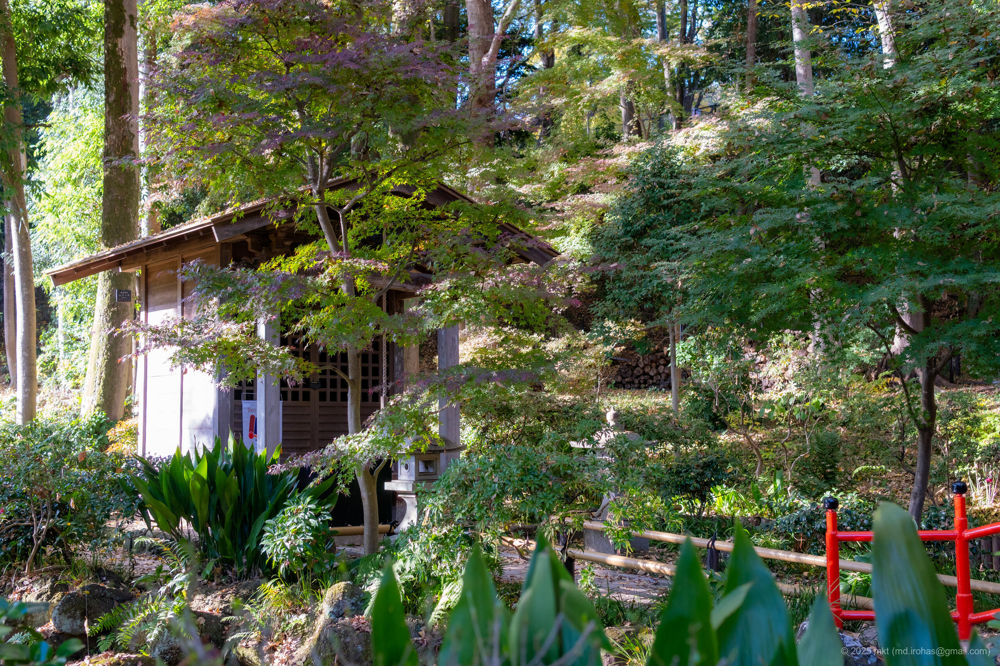

+++
title = 'Trip Photo: Musashi Kokubunji (November, 2025)'
date = '2025-11-24'
categories = ['Blog (Trip Photo)']
tags = ['Trip', 'Photo', 'Tokyo', 'Musashi Kokubunji', 'Otaka no Michi']

isCJKLanguage = false
description = '🍁 A blog post about photos I took at Musashi Kokubunji in November 2025.'
summary = '📍 Musashi Kokubunji, Otaka no Michi'

draft = false

# Params
googlePhotoUrl = 'https://photos.app.goo.gl/x6Xsup8Tp6E9xhTu6'
googleDriveUrl = 'https://drive.google.com/drive/folders/1eP1b4KwQhjxP8Tzch0AM57W-s0Oa4Yc1'
+++

## Story

In November 2025, I took a relaxed bicycle ride around the Musashi Kokubunji area in Kokubunji, Tokyo.



Musashi Kokubunji was one of the provincial temples established during the Nara period.
Today, the historic site is maintained as a park next to the modern Musashi Kokubunji Temple, and the area around it offers walking paths and archaeological remains.

My first stop was the Musashi Kokubunji ruins.  
The park is spacious, with open grounds, pedestals, and trees.
With no tall buildings nearby, walking under the clear autumn sky felt especially refreshing.





A short walk from the ruins brought me to a small museum and a cafe.
Behind them lies a walking path called Otaka no Michi (Otaka Path).



I didn't enter the museum, 
but from the Otaka Path I could see a miniature seven-story pagoda, nicely framed by the beginning of the autumn foliage.







Following the Otaka Path leads to a small stream.  
Along the water is Masugata-ike Pond, where the Masugata Benzaiten shrine is located.



Climbing the stairs past the pond, I came across a small roadside shrine; the path eventually connects back to Musashi Kokubunji Park.



I turned back there, and since it was already lunchtime, I stopped at 'Ota Cafe' for a meal before heading home.





## Gallery





### iPhone 12 mini


  
  


### α6500


  
  
  
  
  
  
  
  




## Map

### Musashi Kokubunji ruins



## Change History

- 2025/11/26: First version.

