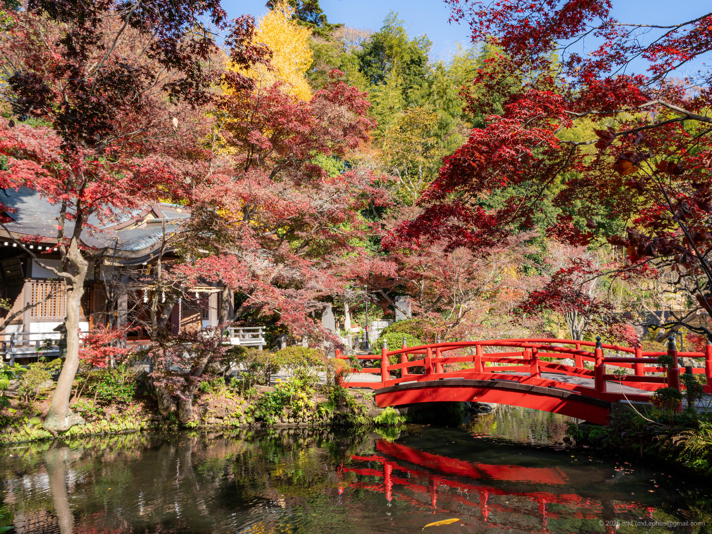
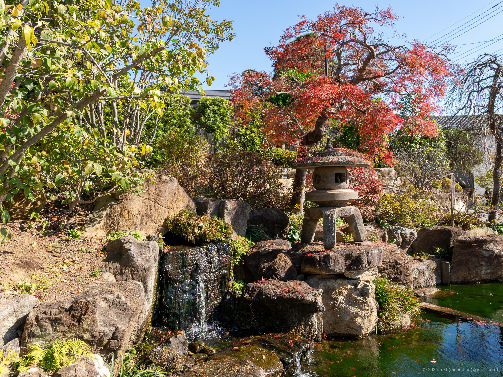

+++
title = 'Trip Photo: Nukui Jinja (November 2025)'
date = '2025-11-27'
categories = ['Blog (Trip Photo)']
tags = ['Trip', 'Photo', 'Tokyo', 'Shrine']

isCJKLanguage = false
description = '⛩️ A blog post about photos I took at Nukui Jinja in November 2025.'
summary = '📍 Nukui Jinja'

draft = false

# Params
googlePhotoUrl = 'https://photos.app.goo.gl/fC7fVwodgy2LXiay9'
googleDriveUrl = 'https://drive.google.com/drive/folders/1pGhahG6ZkIG51D3tB8BE6OzjErIUWDrk'
+++

## Story

In November 2025, I was cycling around the Kokubunji area and decided to stop by Nukui Jinja (Shrine).



Nukui Jinja is a small shrine in Koganei, Tokyo.

The shrine itself is compact, but the grounds are beautifully maintained.
With its main hall, sacred pond, small bridge, and autumn leaves reflecting on the water, the shrine offers many photogenic spots.















## Gallery





### α6500







## Map

### Nukui Jinja



## Change History

- 2025/11/27: First version.

