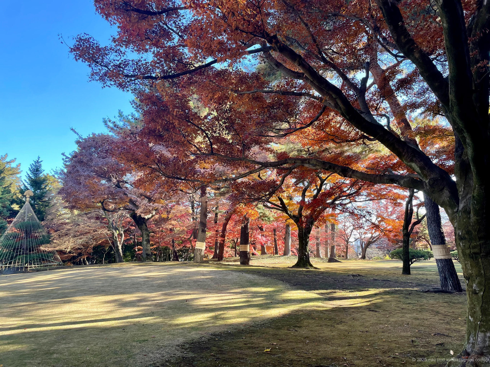
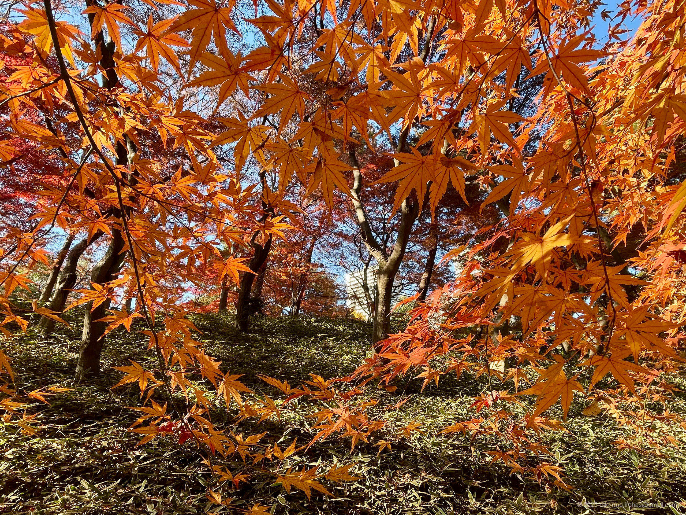
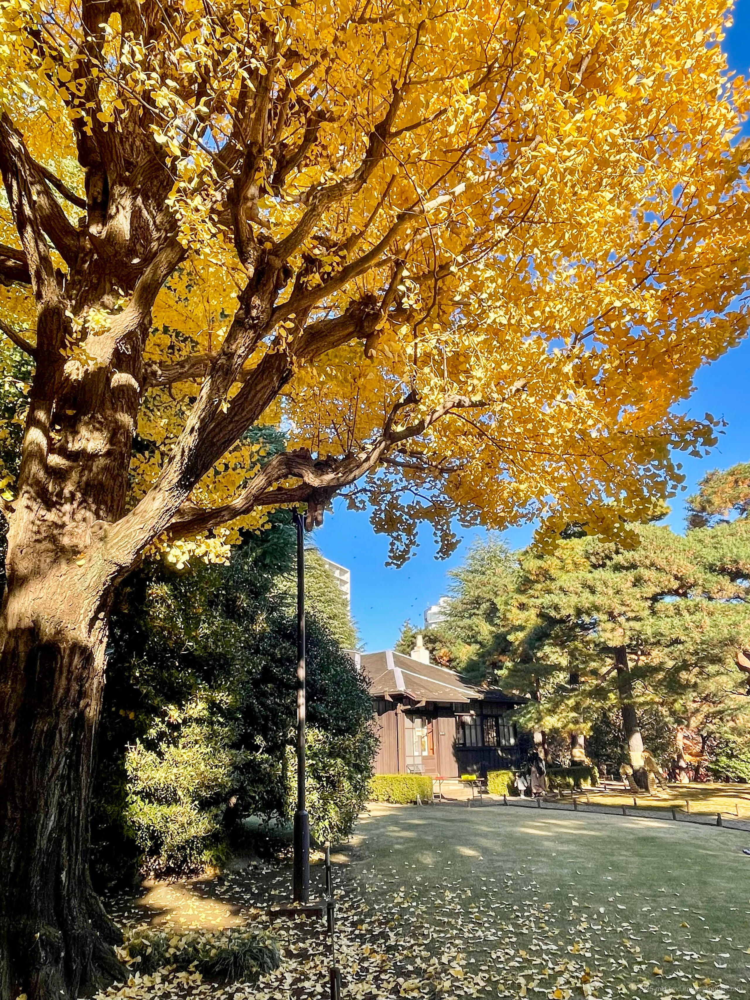
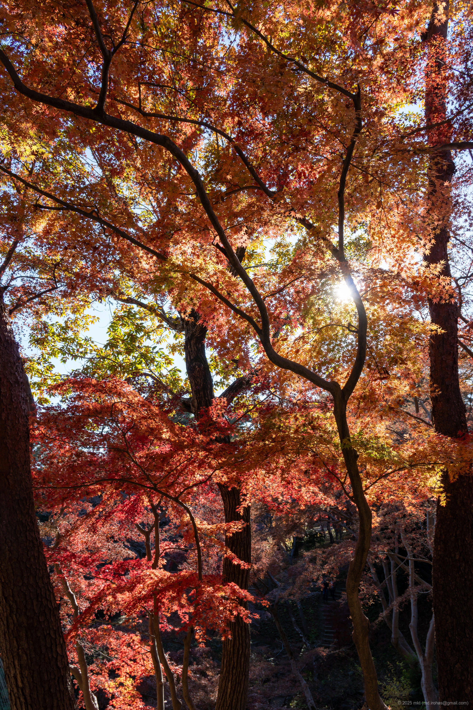
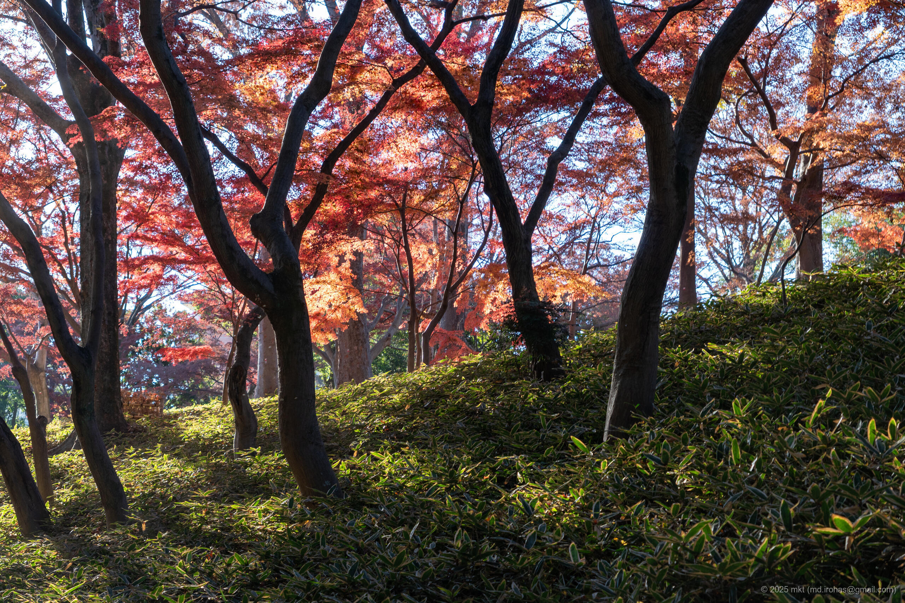

+++
title = '📸 Trip Photo: Tonogayato Garden (December 2025)'
date = '2025-12-13'
categories = ['Blog (Trip Photo)']
tags = ['Trip', 'Photo', 'Tokyo', 'Park', 'Historic Spot']

isCJKLanguage = false
description = '🍁 Photos I took while strolling through Tonogayato Garden in December 2025.'
summary = '📍 Tonogayato Garden'

draft = false

# Params
googlePhotoUrl = 'https://photos.app.goo.gl/52hPahaBqAkhNadH6'
googleDriveUrl = 'https://drive.google.com/drive/folders/1W-OSEbSmcFD14WMD94ypHgNLwNgiwjRi'
+++

## Story

In December 2025, I took a stroll through Tonogayato Garden.

- Tokyo Metropolitan Park Association - Tonogayato Garden: https://www.tokyo-park.or.jp/park/tonogayato/index.html



Tonogayato Garden is a strolling-style Japanese garden in Kokubunji, Tokyo, preserving a historic garden landscape from the Meiji to Taisho era.

The garden features a pond, an artificial hill, and a teahouse, making it a quiet place to enjoy seasonal scenery -- especially autumn colors and fresh spring greenery.

The garden is about a 2-3 minute walk from Kokubunji Station, and admission is JPY 150 per adult.

After paying at the entrance and stepping inside, I came across a wide lawn area near the gate.







As I walked down the slope along the route, I came to a lovely space where bamboo and autumn leaves came together.
It was a Sunday, so the garden was quite busy, and I did not take many photos around this area.







Further in, there was a pond in a small hollow, and up the stairs beyond it stood a building called Koyo-tei.
The view from Koyo-tei was incredible -- the whole scene was filled with autumn colors.





Since I visited in December, the peak had already passed, but there were still plenty of yellow and red leaves.

It was also a Sunday afternoon, so there were lots of visitors, and I could not take photos as freely as I would have liked.
Still, it was a pleasure to walk through such a well-kept garden.

## Gallery





### iPhone 12 mini





### α6500







## Map

### Tonogayato Garden



## Change History

- 2025/12/14: First version.
