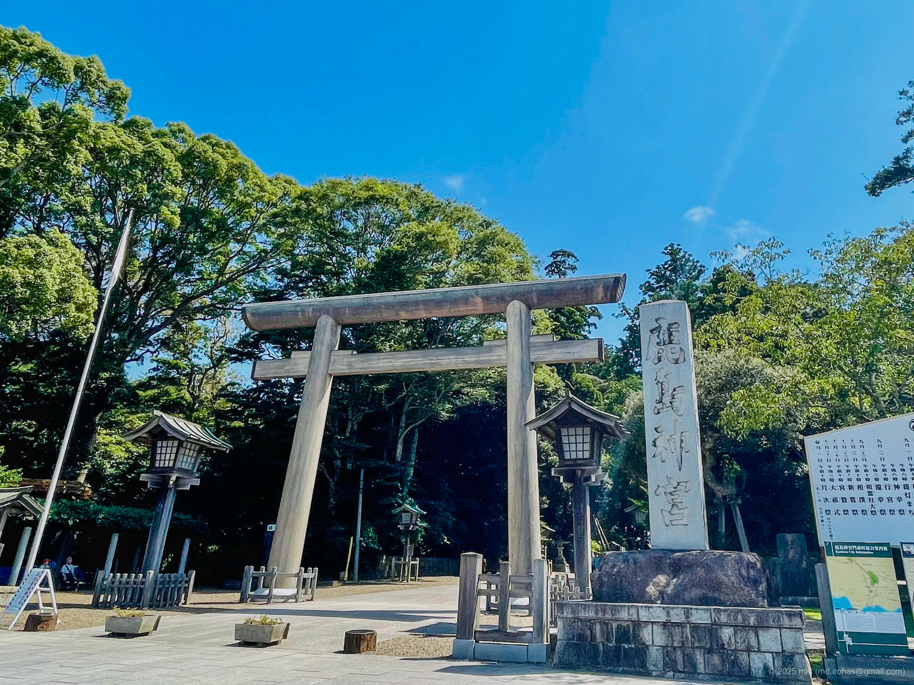
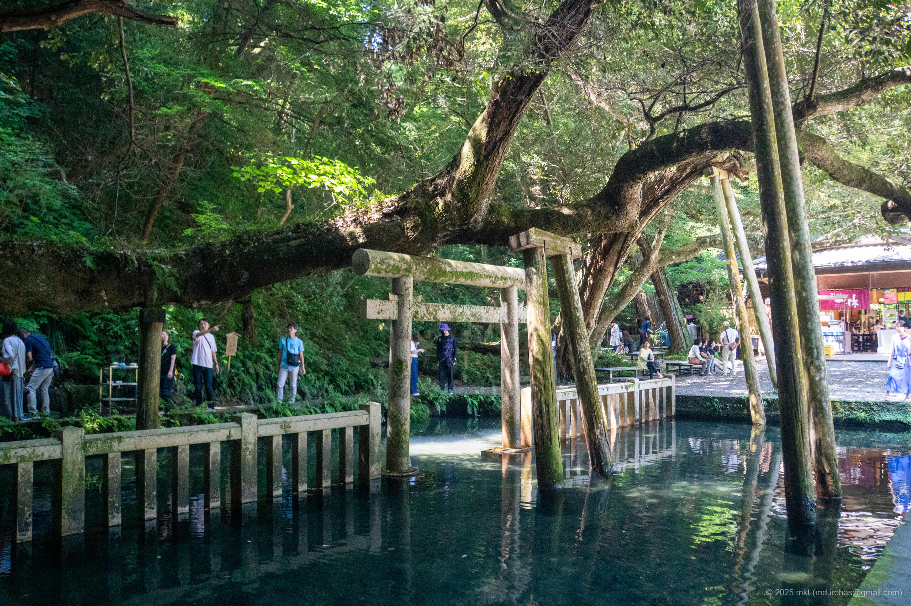

+++
title = '旅の写真: 鹿島神宮（2023年7月）'
date = '2025-12-24'
categories = ['ブログ（旅の写真）']
tags = ['旅行', '写真', '茨城県', '神社']

isCJKLanguage = true
description = '⛩️ 2023年7月に訪れた鹿島神宮で撮影した写真です。'
summary = '📍 鹿島神宮'

draft = false

# Params
googlePhotoUrl = 'https://photos.app.goo.gl/XGhr6LJj86Snxj3g8'
googleDriveUrl = 'https://drive.google.com/drive/folders/1grTa1oYAfZDxZiZp14iHa4fRs1zfRDb5'
+++

 
 


この記事は、2023年に撮影した旅の写真をもとに書き起こしたものです。


## ストーリー

2023年7月、茨城県の鹿島神宮を参拝しました。

- 鹿島神宮: https://kashimajingu.jp/



鹿島神宮は、武の神・[建御雷神（Wikipedia）](https://ja.wikipedia.org/wiki/%E3%82%BF%E3%82%B1%E3%83%9F%E3%82%AB%E3%83%85%E3%83%81) を祀る、国内でも最古級の神社として知られています。

神社までは車で行ったのですが、入口付近は駐車場の呼び込み合戦で不穏な感じでした。
鳥居の近く（いちばん奥）に公式の駐車場があったので、私はそこに停めて参拝しました。



入口付近は観光地らしい雰囲気でしたが、
一転して境内は静かで、奥宮に向かう奥参道は大きな木に囲まれていて、外界から隔絶された空間でした。



奥参道の途中にさざれ石がありました。
「さざれ石」といえば君が代に出てくる言葉ですが、意味としては「小さな石」です。
国歌や信仰の話も絡んでくるので、気になる人は [Wikipedia](https://ja.wikipedia.org/wiki/%E3%81%95%E3%81%96%E3%82%8C%E7%9F%B3) を読んでみてください。



奥には湧水からなる御手洗池がありました。
落ち着いた雰囲気の池でしたが、写真で彩度を調整すると映えるスポットになります。



## ギャラリー





### iPhone 12 mini





### α6500







## マップ

### 鹿島神宮



## 編集履歴

- 2025/12/30: 初稿作成。

