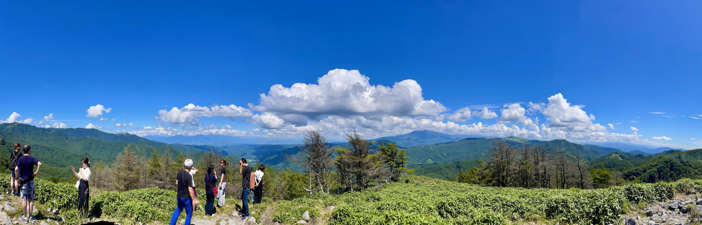
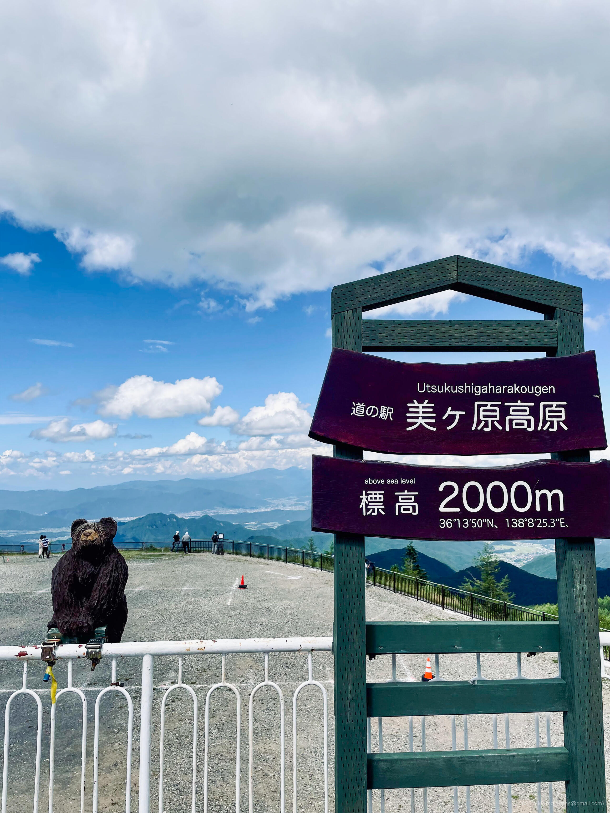
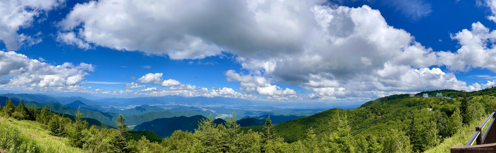
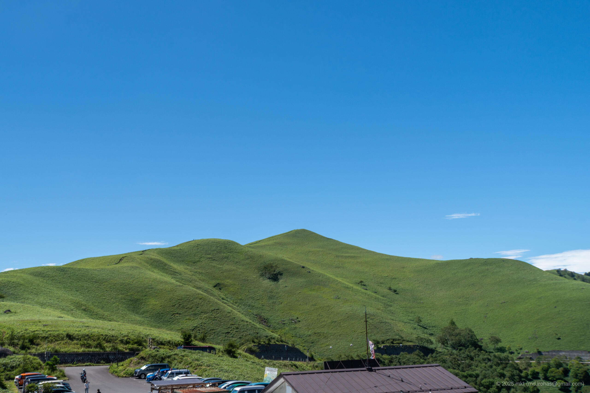
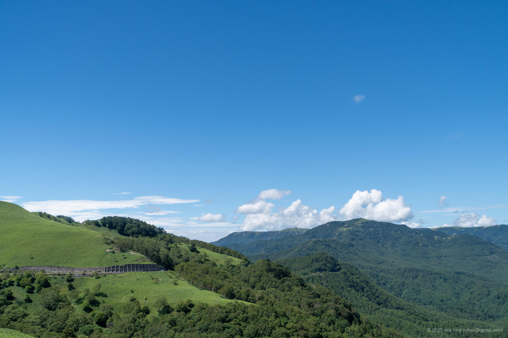
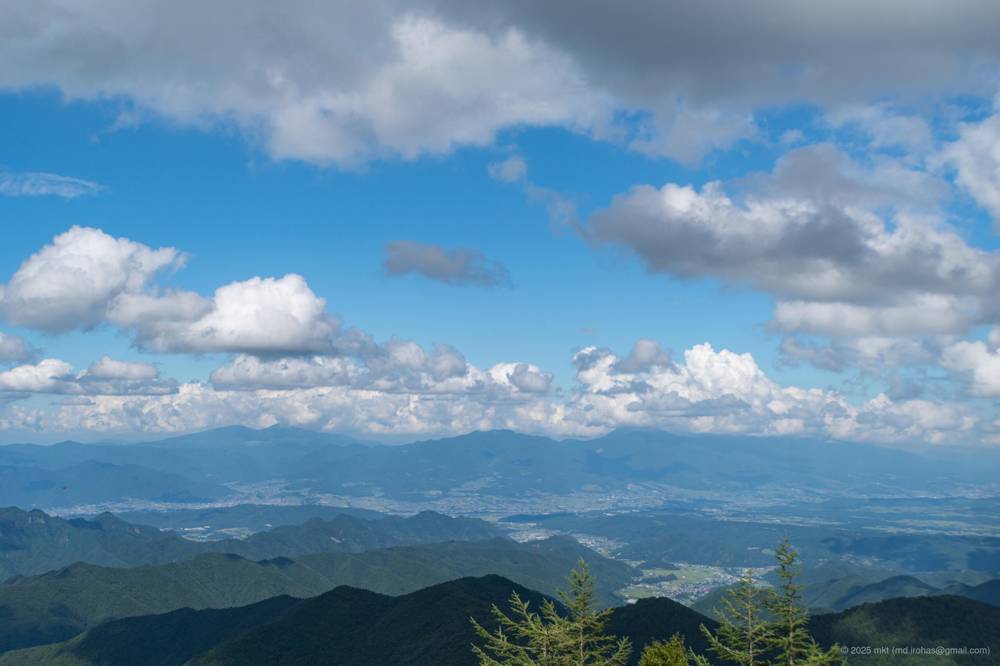

+++
title = '📸 Trip Photo: Suwa Taisha, Venus Line, Utsukushigahara (August, 2023)'
date = '2026-01-03'
categories = ['Blog (Trip Photo)']
tags = ['Trip', 'Photo', 'Nagano', 'Shrine', 'Lake', 'Mountain', 'Scenic Road', 'Lookout']

isCJKLanguage = false
description = '🏞️ Photos I took at the Venus Line and Utsukushigahara in August 2023.'
summary = '📍 Suwa Taisha, Lake Suwa Geyser Center, Venus Line, Mitsumine Teahouse, Roadside Station Utsukushigahara'

draft = false

# Params
googlePhotoUrl = 'https://photos.app.goo.gl/pW5BustVqfFavA9r8'
googleDriveUrl = 'https://drive.google.com/drive/folders/1q6BYsK4IuAf0RCRZX7BY0AHhovCu3yxc'
+++

 
 


This post is based on photos I took in 2023.


## Story

In August 2023, I went on a drive to visit Suwa Taisha, the Venus Line, and Utsukushigahara.



### Suwa Taisha

Suwa Taisha is one of the oldest shrines in Japan, located in Nagano Prefecture.

- Suwa Taisha: https://suwataisha.or.jp/

The shrine is made up of four main sites: two on the south side of Lake Suwa (Maemiya and Honmiya of the Upper Shrine) and two on the north side (Harumiya and Akimiya of the Lower Shrine).




Suwa Taisha is a registered trademark of Shinano-kuni Ichinomiya Suwa Taisha.
Because permission is required to use photos taken on the shrine grounds, I have not included any such photos in this post.


I visited the Upper Shrine (Maemiya and Honmiya) and the Lower Shrine (Harumiya and Akimiya) in that order.
However, since it was unclear how much detail about the visit could be shared, I have omitted the specifics.

### Lake Suwa

On the way from the Upper Shrine to the Lower Shrine, I stopped at the Lake Suwa Geyser Center.



The Lake Suwa Geyser Center is a public facility on the lakeshore.
Inside are exhibits about TV dramas and films shot around Lake Suwa, and behind the building is a geyser (although it hasn't been active recently).
There is also a free foot bath near the parking area.

From behind the building, I could see a wide view of Lake Suwa.



### Venus Line (Mitsumine Teahouse)

After visiting the Lower Shrine of Suwa Taisha, I drove along the Venus Line toward Utsukushigahara.

The Venus Line is a scenic road that runs through Nagano Prefecture along mountain ridges. 
It's popular for driving, motorcycle touring, and cycling thanks to its open views and winding roads.

- Venus Line: https://www.venus-line.net/

I took a break at Mitsumine Teahouse along the Venus Line.



From the observation deck behind the Mitsumine Teahouse, I had an unobstructed 360-degree panorama.


  






### Roadside Station Utsukushigahara

I continued along the Venus Line and stopped at the Roadside Station Utsukushigahara.

- Utsukushigahara: http://www.utsukushigaharakogen.jp/

The roadside station sits on Utsukushigahara and offers views toward the Ueda area.









After descending toward Ueda, I stopped by an onsen before heading home.

## Gallery





### iPhone 12 mini





### α6500







## Map

### Suwa Taisha



### Lake Suwa Geyser Center



### Mitsumine Teahouse



### Roadside Station Utsukushigahara



### Sites



## Change History

- 2026/01/07: First version.

