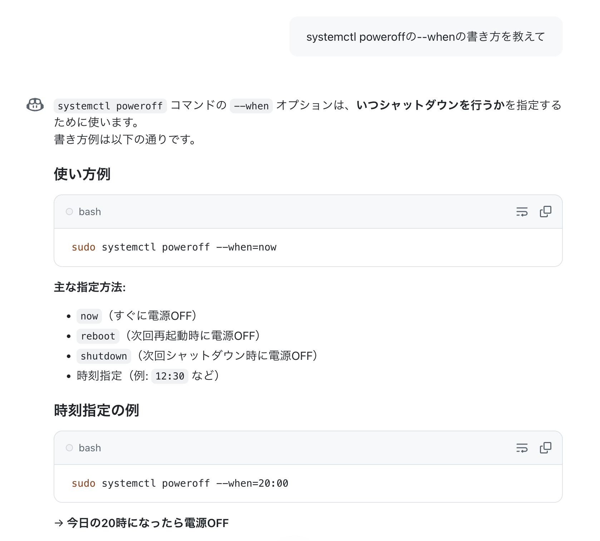

+++
title = 'shutdownとsystemctl poweroffの時刻指定フォーマットの違いを理解する'
date = '2025-10-11'
categories = ['ブログ（技術）']
tags = ['Linux', 'コマンド', 'やらかし']

isCJKLanguage = true
description = 'Linuxのshutdownコマンドとsystemctl poweroff系コマンドの時刻指定フォーマットの違いを理解せずにやらかしたので、自戒をこめて、それぞれの時刻フォーマットとその違いを簡単にまとめます。'
summary = 'Linuxのshutdownコマンドとsystemctl poweroff系コマンドの時刻指定フォーマットの違いを理解せずにやらかしたので、自戒をこめて、それぞれの時刻フォーマットとその違いを簡単にまとめます。'
showReadingTime = false

draft = false

# Params
+++



---

Linuxの `shutdown` コマンドと `systemctl poweroff` 系コマンド（ `systemctl halt` 、 `systemctl reboot` も同様）の時刻指定フォーマットの違いを理解せずにやらかしたので、自戒をこめて、それぞれの時刻フォーマットとその違いを簡単にまとめます。


## 結論

- `shutdown -P 06:00`  
  → （Ubuntuの場合）次の6時、つまり現在時刻が6時前なら今日の6時、過ぎていたら明日の6時。
- `systemctl poweroff --when=06:00`  
  → 今日の6時、過ぎていたら即時。

※これ以外の例は後半に記述しています。


## 検証環境

- Ubuntu Server 24.04 (systemd 255)


## やらかしエピソード

サーバを管理していると法定停電等の停電対応のために、サーバを時刻指定でシャットダウンしたくなることがよくあると思います。

先日、Ubuntu 24.04で`shutdown`コマンドを実行しようとしたら、次の警告が表示されました。

```sh
$ shutdown --help
... 略 ...

This is a compatibility interface, please use the more powerful 'systemctl reboot',
'systemctl poweroff', 'systemctl reboot' commands instead.

# ↑何故か'systemctl reboot'が2回...
# systemdの最新版のソースコードでは修正されてました。
```

なるほど、ついに`shutdown`も`systemd`に統べられるのか。
ということで`systemctl`のmanページを見ました。

```
       poweroff
           ... 略 ...
           This command honors --force and --when= in a similar way as halt.
```

時刻指定には`--when`オプションが使えると。

`--when`オプションの説明を見ると、

```sh
       --when=
           When used with halt, poweroff, reboot or kexec, schedule the action 
           to be performed at the given timestamp, which should adhere to the
           syntax documented in systemd.time(7) section "PARSING TIMESTAMPS". 
```

読むのが面倒だったので、さくっとcopilotくんに聞きました。



なるほど、`shutdown`コマンドと同じか（←これが間違い。というか、時刻指定でrebootとかshutdownって何...）。
確かに、`shutdown`コマンドの実体は`systemctl`へのシンボリックリンクだし。

ということは、`shutdown`コマンド同様に時刻を06:00と指定したら翌日の06:00に実行してくれるんだなと思って、

```sh
$ systemctl poweroff --when="06:00"
```

と入力してエンターを押しました。

すると...

即座に電源が切れました 😇

個人で雑に使うデスクトップPCだったので特に問題はなかったのですが。


## 何が問題だったのか？

おとなしく`systemd.time`のmanページの`PARSING TIMESTAMPS`を見てみましょう。

```sh
... 中略 ...

       Examples for valid timestamps and their normalized form (assuming the current time was 2012-11-23 18:15:22 and the timezone was UTC+8, for example "TZ=:Asia/Shanghai"):

             Fri 2012-11-23 11:12:13 → Fri 2012-11-23 11:12:13
                 2012-11-23 11:12:13 → Fri 2012-11-23 11:12:13
             2012-11-23 11:12:13 UTC → Fri 2012-11-23 19:12:13
                2012-11-23T11:12:13Z → Fri 2012-11-23 19:12:13
              2012-11-23T11:12+02:00 → Fri 2012-11-23 17:12:00
                          2012-11-23 → Fri 2012-11-23 00:00:00
                            12-11-23 → Fri 2012-11-23 00:00:00
                            11:12:13 → Fri 2012-11-23 11:12:13
                               11:12 → Fri 2012-11-23 11:12:00    <- ここ
```

つまり、時刻のみを指定した場合は、日付は"今日"が補完されるわけです。
そして、その時刻を過ぎていた場合、即座にシャットダウンされることになります。

ちょっと不親切ですよね。


## shutdownとsystemctl poweroffの時刻の取り扱い

### shutdown

```sh
       shutdown [OPTIONS...] [TIME] [WALL...]
```

TIMEには以下の値を指定可能です：

- `now`: 即座。
- `+n`: 現在時刻からn分後。
- `hh:mm`: 次のhh時mm分（24時間表記）。例えば06:30であれば、次の6時30分（Ubuntuの場合はこうですが、他のディストリでは未検証）。

なお、shutdownコマンドは日付は指定できません。地味に不便ですね。

```sh
# 何も指定しないと1分後
$ shutdown -P

# 即時実行
$ shutdown -P now

# 次の06:30（時刻はサーバのタイムゾーンが適用されます）
$ shutdown -P 06:30
```


### systemctl poweroff

`--when`オプションで時刻を指定できます。

時刻のフォーマットには、時刻のみ（`hh:mm`）でなく日付やタイムゾーンも指定できます。

ただし、時刻のみを指定した場合は、日付はその日が補完されます。
また、指定時刻を過ぎていた場合は、即時実行されます。

```sh
# 何も指定しないと即時（ここもshutdownと違う）
$ systemctl poweroff

# 今日の6:30に実行。過ぎていたら即時。
$ systemctl poweroff --when="06:30"

# 2025年10月5日 6時30分に実行
$ systemctl poweroff --when="2025-10-05T06:30:00"
```

時刻のみの指定は避けて、ちゃんと日時を指定した方が無難ですね。


## 教訓

公式ドキュメントをちゃんと読みましょう。


## 補足

- Ubuntu 22.04にはまだ`--when`オプションはありません。
- timestampの処理は`systemd-analyze timestamp "06:30"`で確認できます。
- （Ubuntuの場合？）`shutdown`は`systemctl`へのシンボリックリンクですが、指定する時刻フォーマットに互換はありません。systemctl内部で互換コマンドとしてshutdownが実装されているようです。


## 編集履歴

- 2026/09/20: Zennから転載。
- 2025/10/11: 初稿作成（@Zenn）。

