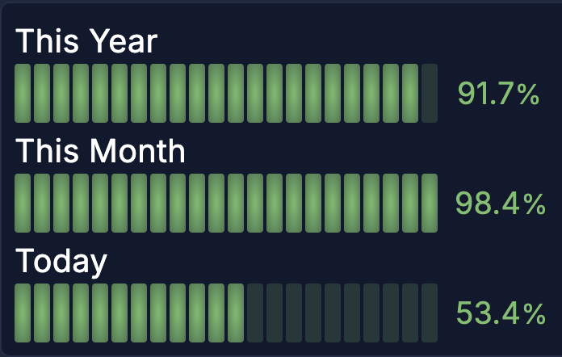

+++
title = '今年・今月・今日は何％終わった？をGrafana + Prometheusで可視化する'
date = '2025-11-30'
categories = ['Blog（技術）']
tags = ['Prometheus', 'Grafana']

isCJKLanguage = true
description = '今年・今月・今日が何%終わったかの経過率をGrafanaとPrometheusで可視化するためのPromQLクエリをまとめました。'
summary = '今年・今月・今日が何%終わったかの経過率をGrafanaとPrometheusで可視化するためのPromQLクエリをまとめました。'
showReadingTime = false

draft = false

# Params
+++





---

記事執筆現在（2025/11/30）、今年も90%が終了したらしいです。



普段GrafanaとPrometheusでシステム監視をしていて、「今年が何%終わった？」をGrafanaのダッシュボードで見れたらといいな思ったので作ってみました。せっかくなので、「今年」だけでなく「今月」「今日」の何%が終わったかも合わせて表示したいと思います。


## 結論

こんな感じのパネルができます。



試行錯誤の結果、最終的には普段使っているGrafanaとPrometheus（PromQL）だけで実現できました。 

各値を計算するPromQLクエリは以下の通りです（UTC版とJST版があります）。

**今年（This Year）**



**今月（This Month）**



**今日（Today）**




もっといい方法があったら教えてください 🙇‍♂️


## 検証環境

検証環境は以下の通りです。

- Ubuntu Server 24.04
  - Grafana: 12.3.0
  - Prometheus: 2.45.3 （Ubuntu 24.04のaptで入るバージョンです）

※今回の検証環境はPrometheus 2系です。3系になるともう少しシンプルに書けるかもしれません（未検証）。


## 計算式

今日・今月・今年が何%終わったか（本記事では「経過率」と呼びます）を表示するためには、いずれにしろその数値を計算する必要があります。

それぞれの計算式自体は、今のUnixtimeから今日・今月・今年の初めのUnixtimeを引いた値を、今日・今月・今年の秒数で割るだけなので難しくないかと思います。

つまり以下の式に相当するPromQLクエリを作成できれば勝ちです。

$$
\begin{align*}
今日の経過率（\%）
&= \frac{\text{現在のUnixtime} - \text{今日の00:00のUnixtime}}{3600 \times 24} \times 100 \\
\\
今月の経過率（\%）
&= \frac{\text{現在のUnixtime} - \text{今月1日の00:00のUnixtime}}{3600 \times 24 \times \text{今月の日数}} \times 100 \\
\\
今年の経過率（\%）
&= \frac{\text{現在のUnixtime} - \text{今年の1月1日の00:00のUnixtime}}{3600 \times 24 \times \text{今年の日数}} \times 100 \\
\end{align*}
$$

なお、サマータイムのような ~~面倒な~~ 対応は想定していません。


## PromQLクエリ

先の計算式をPrometheusのPromQL（Prometheus Query Language）で実現するわけですが、PromQLにはビルトイン関数が定義されているのでそれを使っていきます。

- 参考: https://prometheus.io/docs/prometheus/latest/querying/functions/  
  （※Prometheus 2系と3系でリテラル等の記述が違うので注意）

全体に共通する注意点としては、PromQLが扱う時刻系の関数はUTCを前提にします。そのため、ローカルのタイムゾーンで表現したい場合には、強引ですが、オフセットを追加して補正する必要があります。

以下の説明は地味に重いので、興味のない方は、冒頭のPromQLクエリをコピペしましょう。


### 今日の経過率

まずは今日の経過率。

$$
今日の経過率（\%） = \frac{\text{現在のUnixtime} - \text{今日の00:00のUnixtime}}{3600 \times 24} \times 100
$$

PromQLでは、Unixtimeは `time()` 関数で取得できます。

今日の00:00のUnixtimeは、 `day_of_year()` 関数を使っても計算できます。
が、わざわざ "今日" の00:00を計算しなくても、00:00からの秒数はUnixtimeを1日の秒数の86400（\(= 3600 \times 24\)）で割った余りで算出できるので、雑に剰余で計算します。



日本のタイムゾーン（JST）で表示したい場合には、、32400秒（\(= 9 \times 3600\)）を追加します。



なお、百分率に直すための \(\times 100\) の処理は、Grafana側で対応できるので省略します。


### 今月の経過率

次に、今月の経過率。

$$
今月の経過率（\%） = \frac{\text{現在のUnixtime} - \text{今月1日の00:00のUnixtime}}{3600 \times 24 \times \text{今月の日数}} \times 100
$$

現在のUnixtimeは先述同様に `time()` で良いのですが、問題は「今月1日の00:00のUnixtime」と「今月の日数」です。

当たり前ですが、月の日数はその月によって違うため、今日の経過率のように剰余では計算できません。しかしながら、幸いなことに、後者の「今月の日数」はPromQLの `days_in_month()` 関数が提供してくれます。

では、「今月1日の00:00のUnixtime」はどう計算するか。

結論から言うと、実はPromQLの関数使うと「今月1日の00:00のUnixtime」はわざわざ計算する必要はありません。PromQLには、現在がその月の何日目かを返す `day_of_month()` 関数があるので、分子の「\(\text{現在のUnixtime} - \text{今月1日の00:00のUnixtime}\)」は、直接、

```promql
(day_of_month() - 1) * (3600 * 24)  # 前日までの秒数
+ (time() % (3600 * 24))            # 当日の秒数
```

と書くことができます。

よって、今月の経過率は次のクエリで計算できます。



JSTの場合も同様なのですが、 `day_of_month()` と `days_in_month()` 関数には、UTCではなくJSTで処理してもらう必要があります。これらの関数は引数にUnixtime（ただしvectorで）を渡すと、その時刻の値を取得することができるので、それを使います。



人間が読んで理解するには少し負荷が高いですね...


### 今年の経過率

そして最後に今年の経過率。

$$
今年の経過率（\%） = \frac{\text{現在のUnixtime} - \text{今年の1月1日の00:00のUnixtime}}{3600 \times 24 \times \text{今年の日数}} \times 100
$$

今月の経過率と同じ発想で、「\(\text{現在のUnixtime} - \text{今年の1月1日の00:00のUnixtime}\)」は `day_of_year()` 関数を使えば簡単に算出できます。

```promql
(day_of_year() - 1) * (3600 * 24) # 前日までの秒数
+ (time() % (3600 * 24))          # 当日の秒数
```

さて、問題は今年の日数です。

通常は1年365日ですが、閏年は366日になります。閏年かどうかをif-elseで判定するプログラミングの演習課題は、情報系の学生はほとんど人が通る道だと思います。しかし、PromQLにはif-elseのような条件分岐はありませんし、 `days_in_year()` 関数のような便利な関数も現状はなさそうです。

そこで、チャッピーことChatGPTさんにお尋ねした結果、以下のコードを教えてくれました。

```promql
# その年の日数を算出するPromQL
365
+ clamp_max(
  (
    (
      ((floor(vector(time()) / 31557600) + 1970) % 400) == bool 0
    )
    +
    (
      (((floor(vector(time()) / 31557600) + 1970) % 4) == bool 0)
      *
      (((floor(vector(time()) / 31557600) + 1970) % 100) != bool 0)
    )
  ),
  1
)
```

31557600というのは、365.25日 × 86400秒 に相当する値で、1年を365.25日(実際は365.2425日？)とした近似のようです。 1970-01-01T00:00+00 を0秒とするUnixtimeをその値で割ることで、年の差分を概算しているようです。

また、bool修飾子を使えば条件分岐のような表現が一応可能です。比較演算が true/false を 1/0 に変換する点を利用して、簡単なif-elseの代替を表現できます。

なるほど...　ただ、近似なので、誤差が影響しそうで嫌ですね（どの程度影響するかは未検証）。

少し考えて、PromQLの `day_of_year()` 関数を使えば閏年の判定ができることに気がつきました。
具体的には、閏年であれば年の長さは366日なので、365日（\(= 3600 \times 24 \times 365\)秒）後の同じ時刻の `day_of_year()` を計算すると、その値が現在の値と異なることを使います。

これを使えば、次のように今年が365日か366日かを計算することができます。

```promql
# 今年の日数が365日か366日かを算出するPromQL
365
+
(
  day_of_year() != bool day_of_year(vector(time() + (3600 * 24 * 365)))   # これが1か0か
)
```

今年の経過率を計算する最終的なクエリは以下のようになります。



読みにくいですが、JSTについても同様です。



これで可視化に必要なPromQLのクエリは完成です。

一応動いてそうですが、境界をちゃんと検証したわけではないので、もし不具合がありましたらご指摘ください。


## Grafanaで可視化

ここまでくれば、あとはGrafanaのダッシュボードに好みのパネルを作るだけです。

冒頭のスクショのようなパネルは以下の手順で作成できます。

1. ダッシュボードにパネルを追加します。
1. "Visualization"の種類を"Bar gauge"を選択します。
1. データソースにPrometheusを選択します（Prometheusがデータソースに登録してある前提です）。
1. 今年・今月・今日の経過率のクエリをそれぞれコピペします。Legendは、それぞれ「This Year」「This Month」「Today」にします。
1. 右のサイドバーの設定で、設定を以下のように変更します。
    - Bar gauge:
      - Orientation: Horizontal
      - Display mode: Retro LCD
    - Standard options:
      - Unit: Misc / Percent (0.0-1.0)
      - Min: 0
      - Max: 1

これで以下のような見た目になるはずです。


## 他のデータソースは？

Prometheus以外のデータソースで実現する方法もあるとは思いますが、データソースの種類はたくさんあるので私は検証していません。

NodeExporterやPushgatewayを使っているのであれば、独自のメトリクスを作ってそれを定期的に更新していくのもありかもしれません。また、PostgreSQLは割と複雑なSQLをかけるので、それで算出するのもありでしょうか（そのためにPostgreSQLを立てるとなると面倒ですが...）。


## まとめ

今年・今月・今日の経過率をGrafana + Prometheusで可視化する方法をまとめました。

PromQLのようなDSL (Domain Specific Language) でこれらのクエリを書くのは大変でしたが、頭の体操になって楽しかったです。皆さんが普段使っているデータソースでも同様のことができないか、是非挑戦してみてください。

そしてもっといい方法があったら教えてください。


## 参考資料

- Prometheus: https://prometheus.io/docs/prometheus/latest/querying/functions/  


## 編集履歴

- 2026/09/20: Zennから転載。
- 2025/11/30: 初稿作成（@Zenn）。
